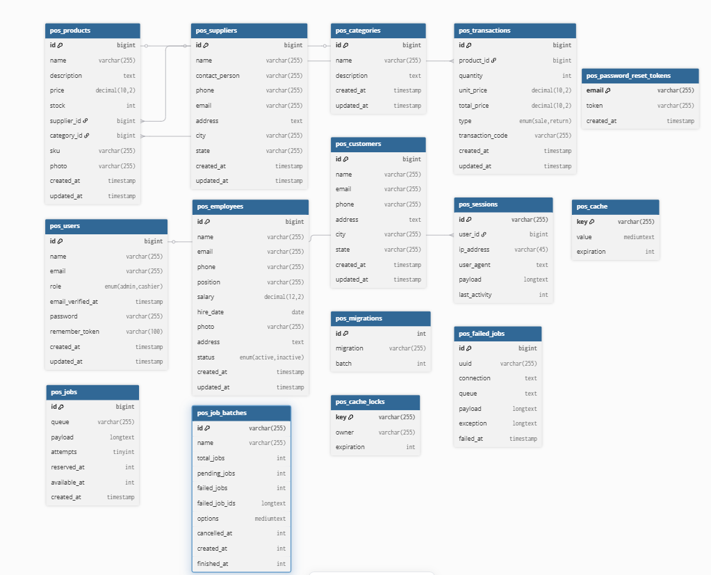
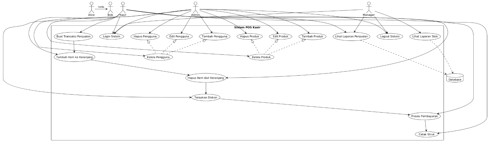

# UKK KASIR - Sistem Point of Sale

Sistem Point of Sale (POS) modern dan lengkap yang dibangun dengan Laravel 12, menampilkan dashboard intuitif dengan statistik real-time, grafik, dan alat manajemen komprehensif untuk pemasok, produk, dan transaksi.

## 📋 Fitur

### Dashboard

-   **Statistik Real-time**: Menampilkan total jumlah pemasok, produk, dan transaksi
-   **Grafik Penjualan**: Visualisasi penjualan bulanan (6 bulan terakhir)
-   **Metrik Utama**: Pelacakan total pendapatan dan nilai transaksi rata-rata
-   **Transaksi Terbaru**: 10 transaksi terbaru dengan akses cepat
-   **Produk Terbaik**: Produk best-seller berdasarkan penjualan
-   **Aksi Cepat**: Akses mudah untuk membuat transaksi baru

### Modul Inti

#### Manajemen Pemasok

-   Operasi CRUD lengkap untuk data pemasok
-   Pelacakan informasi kontak dan lokasi
-   Lihat semua produk terkait untuk setiap pemasok
-   Daftar pemasok dengan paginasi

#### Manajemen Produk

-   Sistem manajemen katalog produk lengkap
-   Menghubungkan produk ke pemasok
-   Melacak harga dan tingkat persediaan
-   Sistem SKU unik untuk identifikasi produk
-   Deskripsi dan detail produk

#### Manajemen Kategori

-   Sistem kategorisasi produk lengkap
-   Operasi CRUD untuk kategori produk
-   Pengelompokan produk berdasarkan tipe
-   Daftar kategori dengan navigasi mudah
-   Asosiasi otomatis produk dengan kategori

#### Manajemen Pegawai

-   Manajemen data karyawan lengkap
-   Pelacakan informasi kontak dan alamat pegawai
-   Pencatatan posisi dan departemen
-   Riwayat dan informasi kepegawaian
-   Akses dan pengelolaan peran pengguna pegawai

#### Transaksi

-   Buat transaksi penjualan dan pengembalian
-   Perhitungan harga real-time
-   Manajemen inventaris otomatis
-   Pembuatan kode transaksi unik
-   Riwayat transaksi dan laporan detail

## 🛠️ Stack Teknologi

-   **Backend**: Laravel 12
-   **Database**: MySQL
-   **Frontend**: Blade Templates + Tailwind CSS
-   **Framework UI**: Tailwind CSS 4
-   **Grafik**: Chart.js
-   **Build Tool**: Vite
-   **Ikon**: Font Awesome 6
-   **Versi PHP**: ^8.2

## 📦 Prasyarat

-   PHP 8.2 atau lebih tinggi
-   Composer
-   MySQL/MariaDB
-   Node.js dan npm (untuk aset frontend)
-   XAMPP atau lingkungan pengembangan lokal serupa

## 🚀 Instalasi & Setup

### 1. Clone Repository

```bash
git clone <repository-url>
cd UKK-KASIR
```

### 2. Install Dependencies PHP

```bash
composer install
```

### 3. Install Dependencies JavaScript

```bash
npm install
```

### 4. Konfigurasi Environment

```bash
cp .env.example .env
php artisan key:generate
```

### 5. Konfigurasi Database

Perbarui file `.env` dengan kredensial database:

```env
DB_CONNECTION=mysql
DB_HOST=127.0.0.1
DB_PORT=3306
DB_DATABASE=ukk_kasir
DB_USERNAME=root
DB_PASSWORD=
```

### 6. Jalankan Migrasi & Seeder Database

```bash
php artisan migrate
php artisan db:seed
```

### 7. Build Aset Frontend

```bash
npm run build
```

Untuk development dengan hot reload:

```bash
npm run dev
```

### 8. Jalankan Server Development

```bash
php artisan serve
```

Aplikasi akan tersedia di `http://localhost:8000`

## 📁 Struktur Proyek

```
├── app/
│   ├── Http/
│   │   ├── Controllers/      # Controller aplikasi
│   │   └── Middleware/       # Middleware custom
│   └── Models/               # Model Eloquent
├── database/
│   ├── migrations/           # Migrasi skema database
│   ├── factories/            # Model factories untuk testing
│   └── seeders/              # Database seeders
├── resources/
│   ├── views/                # Blade templates
│   ├── css/                  # Stylesheet CSS
│   └── js/                   # File JavaScript
├── routes/
│   ├── web.php               # Rute web
│   └── console.php           # Perintah konsol
└── config/                   # Konfigurasi aplikasi
```

## 🗄️ Model Database

-   **User**: Pengguna sistem dengan kontrol akses berbasis peran
-   **Employee**: Informasi dan pelacakan karyawan
-   **Supplier**: Manajemen pemasok
-   **Product**: Katalog produk dengan kategori
-   **Category**: Kategorisasi produk
-   **Transaction**: Transaksi penjualan dan pengembalian

## 🔐 Autentikasi

Sistem mencakup autentikasi pengguna dengan kontrol akses berbasis peran:

-   Admin
-   Kasir/Operator
-   Manajer

## 📝 Perintah Tersedia

```bash
# Jalankan migrasi
php artisan migrate

# Jalankan seeder
php artisan db:seed

# Bersihkan cache
php artisan cache:clear

# Hasilkan kunci aplikasi baru
php artisan key:generate

# Tinker - Shell interaktif
php artisan tinker
```

## 🎨 Pengembangan Frontend

Aset frontend dikelola dengan Vite dan Tailwind CSS:

```bash
# Server development dengan hot reload
npm run dev

# Build untuk production
npm run build
```

## ✨ Fitur Unggulan

-   **UI/UX Modern**: Dibangun dengan Tailwind CSS 4 untuk desain responsif
-   **Update Real-time**: Grafik dan statistik dinamis
-   **Manajemen Inventaris**: Pelacakan stok otomatis
-   **Manajemen Transaksi**: Penanganan transaksi penjualan dan pengembalian lengkap
-   **Pelaporan**: Laporan transaksi dan produk komprehensif
-   **Peran Pengguna**: Kontrol akses berbasis peran untuk tipe pengguna berbeda

## 🗺️ Entity Relationship Diagram (ERD)



##  Unified Modeling Language (UML)


### Struktur Entity:

**USERS**

-   id (PK) - BigInt
-   name - Varchar(255)
-   email (UNIQUE) - Varchar(255)
-   email_verified_at - Timestamp (nullable)
-   password - Varchar(255)
-   role - Enum(admin, cashier)
-   remember_token - Varchar(100) (nullable)
-   created_at - Timestamp
-   updated_at - Timestamp

**EMPLOYEES**

-   id (PK) - BigInt
-   user_id (FK) - BigInt
-   name - Varchar(255)
-   email - Varchar(255)
-   phone - Varchar(255)
-   address - Text
-   city - Varchar(255)
-   state - Varchar(255)
-   hire_date - Date
-   photo - Varchar(255) (nullable)
-   status - Enum(active, inactive)
-   created_at - Timestamp
-   updated_at - Timestamp

**CATEGORIES**

-   id (PK) - BigInt
-   name - Varchar(255)
-   description - Text (nullable)
-   created_at - Timestamp
-   updated_at - Timestamp

**PRODUCTS**

-   id (PK) - BigInt
-   category_id (FK) - BigInt
-   supplier_id (FK) - BigInt
-   name - Varchar(255)
-   sku - Varchar(255)
-   price - Decimal(10,2)
-   stock - Int
-   description - Text (nullable)
-   photo - Varchar(255) (nullable)
-   created_at - Timestamp
-   updated_at - Timestamp

**SUPPLIERS**

-   id (PK) - BigInt
-   name - Varchar(255)
-   contact_person - Varchar(255)
-   phone - Varchar(255)
-   email - Varchar(255)
-   address - Text
-   city - Varchar(255)
-   state - Varchar(255)
-   created_at - Timestamp
-   updated_at - Timestamp

**TRANSACTIONS**

-   id (PK) - BigInt
-   product_id (FK) - BigInt
-   quantity - Decimal(10,2)
-   unit_price - Decimal(10,2)
-   total_price - Decimal(10,2)
-   transaction_code - Varchar(255)
-   type - Varchar(255)
-   created_at - Timestamp
-   updated_at - Timestamp

**CUSTOMERS**

-   id (PK) - BigInt
-   name - Varchar(255)
-   email - Varchar(255) (nullable)
-   phone - Varchar(255) (nullable)
-   address - Text (nullable)
-   city - Varchar(255) (nullable)
-   state - Varchar(255) (nullable)
-   created_at - Timestamp
-   updated_at - Timestamp

### Relasi Database:

-   **USERS ↔ EMPLOYEES**: 1:1 (Setiap user bisa memiliki 1 employee)
-   **CATEGORIES ↔ PRODUCTS**: 1:N (1 kategori memiliki banyak produk)
-   **SUPPLIERS ↔ PRODUCTS**: 1:N (1 supplier memiliki banyak produk)
-   **PRODUCTS ↔ TRANSACTIONS**: 1:N (1 produk bisa terlibat dalam banyak transaksi)

## 📄 Lisensi

Proyek ini bersifat open source dan tersedia di bawah lisensi MIT.

## 👥 Developer

Dibuat sebagai proyek UKK (Unit Kompetensi Khusus) untuk tujuan pendidikan.

## 📞 Dukungan

Untuk masalah atau pertanyaan, silakan lihat dokumentasi atau hubungi tim pengembang.

In order to ensure that the Laravel community is welcoming to all, please review and abide by the [Code of Conduct](https://laravel.com/docs/contributions#code-of-conduct).

## Security Vulnerabilities

If you discover a security vulnerability within Laravel, please send an e-mail to Taylor Otwell via [taylor@laravel.com](mailto:taylor@laravel.com). All security vulnerabilities will be promptly addressed.

## License

The Laravel framework is open-sourced software licensed under the [MIT license](https://opensource.org/licenses/MIT).
